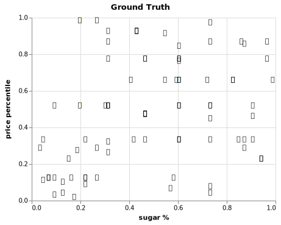

Title: Life is like a box of chocolates
Date: 2019-04-19 12:00
Tags: python
Slug: chocolate

Do you have a sweet tooth, a guilty pleasure, or something that you eat to make you feel _happy_? Given some attributes of a snack, can I classify your favourite snack as a chocolate, or not chocolate (i.e. candy)? 

For example, if you told me that your favourite snack contains peanuts, and is not in a bar shape, my model should guess that this is chocolate (Reese Pieces)!

This is a classification problem, so let's spin up decision trees and sprinkle in some ensemble methods
(bagging & boosting) to improve prediction performance, and add a kick of flavour. This is a fun exercise to explore a variety of algorithms!

---

### Data

Data is from [The Ultimate Halloween Candy Power Ranking](https://github.com/fivethirtyeight/data/tree/master/candy-power-ranking).

`candy-data.csv` includes attributes for each snack. For binary variables, 1 means yes, 0 means no.

The data contains the following fields:

<table class="table table-striped table-bordered">
<thead>
<tr>
<th>Feature</th>
<th>Description</th>
</tr>
</thead>
<tbody>
<tr>
<td>chocolate</td>
<td>Does it contain chocolate?</td>
</tr>
<tr>
<td>fruity</td>
<td>Is it fruit flavored?</td>
</tr>
<tr>
<td>caramel</td>
<td>Is there caramel in the candy?</td>
</tr>
<tr>
<td>peanutalmondy</td>
<td>Does it contain peanuts, peanut butter or almonds?</td>
</tr>
<tr>
<td>nougat</td>
<td>Does it contain nougat?</td>
</tr>
<tr>
<td>crispedricewafer</td>
<td>Does it contain crisped rice, wafers, or a cookie component?</td>
</tr>
<tr>
<td>hard</td>
<td>Is it a hard candy?</td>
</tr>
<tr>
<td>bar</td>
<td>Is it a candy bar?</td>
</tr>
<tr>
<td>pluribus</td>
<td>Is it one of many candies in a bag or box?</td>
</tr>
<tr>
<td>sugarpercent</td>
<td>The percentile of sugar it falls under within the data set.</td>
</tr>
<tr>
<td>pricepercent</td>
<td>The unit price percentile compared to the rest of the set.</td>
</tr>
</tbody>
</table>

#### Import libraries


```python
# data wrangling
import pandas as pd
import numpy as np

# plotting & viz
import matplotlib.pyplot as plt
%matplotlib inline
%config InlineBackend.figure_format = 'svg'
plt.style.use('fivethirtyeight')
import altair as alt 
alt.renderers.enable('notebook')
from IPython.display import HTML

# tree visualization
from IPython.display import Image  
import pydotplus

# supervised learning - modelling
from sklearn.tree import DecisionTreeClassifier
from sklearn import tree
import catboost as cb
from catboost import cv, CatBoostClassifier, Pool
from sklearn.model_selection import GridSearchCV 

# unsupervised learning
from sklearn.cluster import KMeans

# model selection and evaluation
from sklearn.model_selection import train_test_split, GridSearchCV, cross_val_score
from sklearn.metrics import roc_auc_score, accuracy_score, make_scorer

# ensemble methods
from sklearn.ensemble import BaggingClassifier, RandomForestClassifier

# support warnings
import warnings
warnings.filterwarnings(action='ignore', category=DeprecationWarning)
```


```python
df = pd.read_csv('./data/candy_data.csv')
```


```python
# remove fake candies, One Dime, One Quarter
df[(df.competitorname == "One dime") | (df.competitorname == "One quarter")] #index 47,77
df = df.drop([47,77]).reset_index()
df = df.drop(['index','winpercent'], 1) # drop win_%, focus on the snack attributes
# great, now we have 83 observations to practice models on
HTML(df.head().to_html(classes="table table-responsive table-striped table-bordered"))
```


<table border="1" class="dataframe table table-responsive table-striped table-bordered">
  <thead>
    <tr style="text-align: right;">
      <th></th>
      <th>competitorname</th>
      <th>chocolate</th>
      <th>fruity</th>
      <th>caramel</th>
      <th>peanutyalmondy</th>
      <th>nougat</th>
      <th>crispedricewafer</th>
      <th>hard</th>
      <th>bar</th>
      <th>pluribus</th>
      <th>sugarpercent</th>
      <th>pricepercent</th>
    </tr>
  </thead>
  <tbody>
    <tr>
      <th>0</th>
      <td>Reeses Peanut Butter cup</td>
      <td>1</td>
      <td>0</td>
      <td>0</td>
      <td>1</td>
      <td>0</td>
      <td>0</td>
      <td>0</td>
      <td>0</td>
      <td>0</td>
      <td>0.720</td>
      <td>0.651</td>
    </tr>
    <tr>
      <th>1</th>
      <td>Reeses Miniatures</td>
      <td>1</td>
      <td>0</td>
      <td>0</td>
      <td>1</td>
      <td>0</td>
      <td>0</td>
      <td>0</td>
      <td>0</td>
      <td>0</td>
      <td>0.034</td>
      <td>0.279</td>
    </tr>
    <tr>
      <th>2</th>
      <td>Twix</td>
      <td>1</td>
      <td>0</td>
      <td>1</td>
      <td>0</td>
      <td>0</td>
      <td>1</td>
      <td>0</td>
      <td>1</td>
      <td>0</td>
      <td>0.546</td>
      <td>0.906</td>
    </tr>
    <tr>
      <th>3</th>
      <td>Kit Kat</td>
      <td>1</td>
      <td>0</td>
      <td>0</td>
      <td>0</td>
      <td>0</td>
      <td>1</td>
      <td>0</td>
      <td>1</td>
      <td>0</td>
      <td>0.313</td>
      <td>0.511</td>
    </tr>
    <tr>
      <th>4</th>
      <td>Snickers</td>
      <td>1</td>
      <td>0</td>
      <td>1</td>
      <td>1</td>
      <td>1</td>
      <td>0</td>
      <td>0</td>
      <td>1</td>
      <td>0</td>
      <td>0.546</td>
      <td>0.651</td>
    </tr>
  </tbody>
</table>


```python
df.chocolate.value_counts()
# we have a pretty balanced class, between signal (#37 chocolates) and noise, and no missing values
# great, no imbalanced classes procedure, or imputation required
```


    0    46
    1    37
    Name: chocolate, dtype: int64


```python
# target
y = df["chocolate"]

# design matrix
X = df.loc[:, 'fruity':'pricepercent']

# train, test, split
X_train, X_test, y_train, y_test = train_test_split(X, y, test_size=0.25, random_state=42)
```


```python
# baseline
1 - y.mean()
```


    0.5542168674698795


Let's establish a 'naive model'. If we predicted everything as 100% chocolate, then we would be 55% accurate. This is our bench accuracy to beat.

---
### Trees 🌲

#### Vanilla decision tree


```python
# Instantiate 
tree_model = DecisionTreeClassifier(random_state=42)

# Fit 
tree_model.fit(X_train,y_train);
```

#### Seeing is believing
While trees are non parametric, one key benefit of decisions trees is that it's simple and interpretable with printouts. 


```python
dot_data = tree.export_graphviz(
    tree_model, 
    out_file=None, 
    feature_names=X.columns,  
    class_names=["chocolate","candy"] #1 -> chocolate, 0 -> candy
)

graph = pydotplus.graph_from_dot_data(dot_data)  
# Image(graph.create_png())
# graph.write_svg("candytree.svg");
```


First, the tree is split on fruit flavour. If it's fruity, then it's probably not chocolate. Makes sense. 

And, if the snack is singular (i.e. 'pluribus'), contains peanuts, is high in sugar, and has nougats, then it's probably chocolate.


--- 

* By default, the tree is split at each node based on Gini impurity. Gini is a measure of variance across the K classes; the smaller the Gini index, the better.


* Remember, for a binary class, gini = 0 is a 'pure' split representing perfect equality, whereas gini = 0.5 is not pure.


* You may see some splits where the nodes are both predicted to be chocolate. Well, why is a split event performed? Well, the split occurred because it increased node purity. That is the left split has 2/2 observations with a response value of chocolate, where as the right split is 1/2. If we have a new observation that belongs to the region in the left leaf, we can be sure its response value is chocolate, in contrast, if it goes into the right leaf, than it is probably yes, but we are much less certain.

Now, let's use our model to predict if Reese's and Fuzzy Peaches are chocolate or not.


```python
# X.iloc[0:1,:].to_dict(orient="list")

reeses = {'fruity': [0],
 'caramel': [0],
 'peanutyalmondy': [1],
 'nougat': [0],
 'crispedricewafer': [0],
 'hard': [0],
 'bar': [0],
 'pluribus': [0],
 'sugarpercent': [0.72000003],
 'pricepercent': [0.65100002]}

# new observation 
fuzzy_peach = {'fruity': [1],
 'caramel': [0],
 'peanutyalmondy': [0],
 'nougat': [0],
 'crispedricewafer': [0],
 'hard': [0],
 'bar': [0],
 'pluribus': [0],
 'sugarpercent': [0.75],
 'pricepercent': [0.5]}

reeses = pd.DataFrame(reeses)
fuzzy_peach = pd.DataFrame(fuzzy_peach)
```


```python
print(f' It\'s chocolate! {tree_model.predict(reeses)}')
print(f' It\'s candy! {tree_model.predict(fuzzy_peach)}')
```

     It's chocolate! [1]
     It's candy! [0]


```python
# Score: By default, cross_val_score calculates accuracy for trees
print(f' tree_model train accuracy: {cross_val_score(tree_model, X_train, y_train, cv=5, scoring=make_scorer(accuracy_score)).mean()}')
print(f' tree_model test accuracy: {cross_val_score(tree_model, X_test, y_test, cv=5).mean()}')
```

     tree_model train accuracy: 0.7931235431235432
     tree_model test accuracy: 0.7366666666666667


A vanilla tree performs okay, as it's able to classify 74% of our test observations correctly, but there is some overfitting. 

It is significantly better than a naive model, so it is picking up signal. This is our new benchmark to beat. By applying bagging, let's see if we can cut down the variance.

---
### Ensemble methods

#### Bagging

Bagging stands for bootstrap aggregating. 

By definition, it's an averaging method and the idea is to build several bootstrapped estimators (i.e. trees) independently and then to average their predictions. The combined estimator is usually better than any of the single base estimator because its variance should be reduced.

Usually, bagging mitigates overfitting by exposing different trees to different sub-samples of the training set.


```python
# Set of bagged decision trees

# Instantiate
bag = BaggingClassifier(n_estimators=100, max_samples=1.0, random_state = 42)
# 'n_estimators=10', -> 10 trees in the ensemble to be averaged
# 'max_samples=1.0', -> 1 samples to draw from X to train each tree

# Fit
bag.fit(X_train, y_train)

# Predict
print(f' bagged decision tree train accuracy {cross_val_score(bag, X_train, y_train, cv=5).mean()}')
print(f' bagged decision tree test accuracy {cross_val_score(bag, X_test, y_test, cv=5).mean()}')
```

     bagged decision tree train accuracy 0.8367132867132867
     bagged decision tree test accuracy 0.7366666666666667


As we increased the `n_estimators`, the test accuracy improved, but it's capped at about 74%. This did not improve over our vanilla tree on the test set. Perhaps, we are still averaging highly correlated trees, therefore we are not enjoying the benefits of bagging.

Suppose that there is one very strong predictor, along with a number of other moderately strong predictors. Then in the collection of bagged trees, most or all of the trees will use this strong predictor in the top split (i.e. fruity). Consequently, all of the bagged trees will look quite similar to each other. 

Hence, the predictions from the bagged trees will be highly correlated -> averaging many highly correlated quantities does not lead to as large of a reduction in variance -> bagging will not lead to a substantial reduction in variance over a single tree in this setting.

---
#### Random Forest 🌳🌳🌳
Let's not be so greedy and gluttonous.

Vanilla decisions trees and bagging uses a top-down, greedy approach. It is greedy because at each step of the tree-building process, the best split is made at that particular step, rather than looking ahead and picking a split that will lead to a better tree in some future step.

Random forests provide an improvement over bagged trees by way of a random small tweak that decorrelates the trees. Each time a split in a tree is considered, a random sample of m<p predictors is chosen as split candidates from the full set of p predictors. 

The split is allowed to use only one of those m predictors, and this ultimately helps decorrelates the trees and generally leads to more accurate predictions. 


```python
#  random forest
random_forest_model = RandomForestClassifier(n_estimators=10, random_state=42)

print(cross_val_score(random_forest_model, X_train, y_train, cv=5).mean())
print(cross_val_score(random_forest_model, X_test, y_test, cv=5).mean())
```

    0.8564102564102564
    0.8033333333333333


Random forests further improved the accuracy on the test set to 80%, and there is less overfitting now compared to bagging. The randomness introduced, also decreased the variance.

Let's fine tune our hyperparameters to optimize the performance.


```python
# Grid Search over n estimators, max samples
params = {
    'n_estimators': [5, 10, 15], 
    'max_depth': [None, 1, 2], 
    'min_samples_split': [3, 4, 5]
}

# instantiate 
rf_grid_search = GridSearchCV(random_forest_model, param_grid=params, cv=5)
rf_grid_search.fit(X_train, y_train)

# up to 90% on train, increased with more trees but not too many
# but doesn't really matter as larger number of trees do not overfit as you are averaging
# 86% accuracy on test!
print(rf_grid_search.best_score_)
print(rf_grid_search.best_params_)
print(rf_grid_search.score(X_test,y_test))
```

    0.9032258064516129
    {'max_depth': None, 'min_samples_split': 4, 'n_estimators': 10}
    0.8571428571428571


---
#### Boosting 
Let's introduce another ensemble method. 

With boosting methods, trees are grown sequentially. Each tree is grown using information from previously grown trees. Boosting does not involve bootstrap sampling; instead each tree is fit on a modified version of the original data set. Similarly, the final prediction is constructed by a weighted vote: Weights for each base model depend on their training errors or misclassification rates.

This method focuses on reduce bias by taking weak learners to start, and the algorithm is penalize wrong predictions in an iterative nature. Note, the number of trees is important here, as boosting can overfit, unlike in bagging and random forests. We can use cross validation to choose `n_estimators`. Boosting focuses on reducing bias, but can also reduce variance.<br>

##### CatBoost  🐱

Do cats like chocolate? I don't know. Let's see if this boosting model can really purr, by implementing Cat Boost. 

[CatBoost](https://github.com/catboost/catboost) is a flavour (are you sick of my food puns yet), of boosting. It is a fast, scalable, high performance gradient boosting on decision trees library, used for ranking, classification, regression and other machine learning tasks.

This is a pretty small data set, so we won't really see it shine like with large data sets, but it does come with some neat graphics for model evaluation metrics, which I did want to highlight.


```python
# Instantiate
cat_model = cb.CatBoostClassifier(
    iterations=100, 
    early_stopping_rounds=10, # stop after 10 rounds if no improvement
    custom_loss=['AUC', 'Accuracy'], # captures logloss by default, also capture auc and accuracy
    random_state = 42
)

# fit
cat_model.fit(X_train, y_train, eval_set=(X_test, y_test),verbose=False);
```


```python
# categorical data
# indices 0 to 7 
categorical_features_indices = list(range(0, 8))

cv_params = {'early_stopping_rounds': 10,
 'random_state': 42,
 'custom_loss': ['AUC', 'Accuracy'],
 'loss_function': 'Logloss',
 'iterations': 100}
```


```python
cv_data = cv(
    Pool(X, y, cat_features=categorical_features_indices),
    cv_params,
    fold_count=5,
    verbose=False)
#    plot=True
# 55 iterations for it to stabilize, 5 folds cv
```


```python
best_value = np.min(cv_data['test-Logloss-mean'])
best_iter = cv_data['test-Logloss-mean'].idxmin()

print('Best validation Logloss score, {:.4f}±{:.4f} on step {}'.format(
    best_value,
    cv_data['test-Logloss-std'][best_iter],
    best_iter)
)
```

    Best validation Logloss score, 0.3301±0.1217 on step 45


```python
print('Validation accuracy score, {:.4f} on step {}'.format(
    cv_data[cv_data["iterations"]==45]["test-Accuracy-mean"].to_numpy()[0],
    best_iter))
```

    Validation accuracy score, 0.8779 on step 45


Aside: By default, CatBoost optimizes for minimizing logloss, and with cross validation we select the model at 45 iterations. Basically, logloss increases as the predicted probability diverges from the actual label.

<table class="table">
<thead class="table-striped">
<tr>
<th>Test scores</th>
<th>Naive</th>
<th>Vanilla Decision Tree</th>
<th>Bagging</th>
<th>Random Forest</th>    
<th>CatBoost</th>
</tr>
<tbody>
<tr>
<td>Accuracy</td>
<td>55.4%</td>
<td>73.7%</td>
<td>73.7%</td>
<td>85.7%</td>
<td>87.8%</td>
</tr>
</tbody>
</table>

As a caveat, with ensemble methods it is not always apparent which variables are most important to the procedure. Generally, boosting and bagging methods improves prediction accuracy at the expense of interpretability. Luckily, CatBoost has a`feature_importances` method to understand which feature made the greatest contribution to the final result. 

This shows that features `fruity` and `pricepercent` had the biggest influence on classifying if something was a chocolate or a candy. The same as our vanilla tree print out.


```python
cat_model.get_feature_importance(prettified=True)
```


    [('fruity', 62.812208418548465),
     ('pricepercent', 21.388700907444946),
     ('pluribus', 4.915296243219509),
     ('sugarpercent', 3.809671603132506),
     ('caramel', 2.8654253284742484),
     ('nougat', 1.620219841699855),
     ('bar', 1.4484940632542251),
     ('hard', 1.0595256574622567),
     ('peanutyalmondy', 0.06755089925898686),
     ('crispedricewafer', 0.012907037505001707)]


---
### Bonus: Unsupervised learning

For a taste of what's to come in future posts, let's apply unsupervised learning to a problem to identify targets labels, y. No labels are given to the learning algorithm; it's left to find structure in its input. Unsupervised learning can be a goal in itself (discovering hidden patterns in data), or a means towards an end (feature learning). This is the latter application.


Suppose you're a manager at Cadbury, and you want to create a new confectionery product for the masses. However, all you know is certain attributes of your snacks, and want to identify if there structure in your inventory. If there are patterns, then you might be able to create a new product with attributes that people will enjoy!

---

#### Life is like a 'cluster' of chocolates - Forrest Gump


Okay, let's pretend we only have X. Our previous supervised learning model wouldn't be able to learn, and predict if something was chocolate or candy.

How might we cluster these snacks into different categories? 

We can use K-means clustering to solve this, it's one of the most common methods. Again, we are NOT classifying explicitly, but rather exploring if there are common characteristics in k groups.


```python
X = df.loc[:, 'fruity':'pricepercent']
HTML(X.sample().to_html(classes="table table-responsive table-striped table-bordered"))
```


<table border="1" class="dataframe table table-responsive table-striped table-bordered">
  <thead>
    <tr style="text-align: right;">
      <th></th>
      <th>fruity</th>
      <th>caramel</th>
      <th>peanutyalmondy</th>
      <th>nougat</th>
      <th>crispedricewafer</th>
      <th>hard</th>
      <th>bar</th>
      <th>pluribus</th>
      <th>sugarpercent</th>
      <th>pricepercent</th>
    </tr>
  </thead>
  <tbody>
    <tr>
      <th>78</th>
      <td>1</td>
      <td>0</td>
      <td>0</td>
      <td>0</td>
      <td>0</td>
      <td>1</td>
      <td>0</td>
      <td>1</td>
      <td>0.093</td>
      <td>0.511</td>
    </tr>
  </tbody>
</table>


First, let's look at the ground truth. 


```python
df['emoji'] = [{1: '🍫', 0: '🍬'}[snack] for snack in df['chocolate']]
HTML(df.head().to_html(classes="table table-responsive table-striped table-bordered"))
```


<table border="1" class="dataframe table table-responsive table-striped table-bordered">
  <thead>
    <tr style="text-align: right;">
      <th></th>
      <th>competitorname</th>
      <th>chocolate</th>
      <th>fruity</th>
      <th>caramel</th>
      <th>peanutyalmondy</th>
      <th>nougat</th>
      <th>crispedricewafer</th>
      <th>hard</th>
      <th>bar</th>
      <th>pluribus</th>
      <th>sugarpercent</th>
      <th>pricepercent</th>
      <th>emoji</th>
    </tr>
  </thead>
  <tbody>
    <tr>
      <th>0</th>
      <td>Reeses Peanut Butter cup</td>
      <td>1</td>
      <td>0</td>
      <td>0</td>
      <td>1</td>
      <td>0</td>
      <td>0</td>
      <td>0</td>
      <td>0</td>
      <td>0</td>
      <td>0.720</td>
      <td>0.651</td>
      <td>🍫</td>
    </tr>
    <tr>
      <th>1</th>
      <td>Reeses Miniatures</td>
      <td>1</td>
      <td>0</td>
      <td>0</td>
      <td>1</td>
      <td>0</td>
      <td>0</td>
      <td>0</td>
      <td>0</td>
      <td>0</td>
      <td>0.034</td>
      <td>0.279</td>
      <td>🍫</td>
    </tr>
    <tr>
      <th>2</th>
      <td>Twix</td>
      <td>1</td>
      <td>0</td>
      <td>1</td>
      <td>0</td>
      <td>0</td>
      <td>1</td>
      <td>0</td>
      <td>1</td>
      <td>0</td>
      <td>0.546</td>
      <td>0.906</td>
      <td>🍫</td>
    </tr>
    <tr>
      <th>3</th>
      <td>Kit Kat</td>
      <td>1</td>
      <td>0</td>
      <td>0</td>
      <td>0</td>
      <td>0</td>
      <td>1</td>
      <td>0</td>
      <td>1</td>
      <td>0</td>
      <td>0.313</td>
      <td>0.511</td>
      <td>🍫</td>
    </tr>
    <tr>
      <th>4</th>
      <td>Snickers</td>
      <td>1</td>
      <td>0</td>
      <td>1</td>
      <td>1</td>
      <td>1</td>
      <td>0</td>
      <td>0</td>
      <td>1</td>
      <td>0</td>
      <td>0.546</td>
      <td>0.651</td>
      <td>🍫</td>
    </tr>
  </tbody>
</table>


```python
ground_truth = (alt.Chart(df, title='Ground Truth').mark_text(filled=True).encode(
    x=alt.X('sugarpercent', axis=alt.Axis(title='sugar percentile', values = [0,0.2,0.4,0.6,0.8,1])),
    y=alt.X('pricepercent', axis=alt.Axis(title='price percentile', values = [0,0.2,0.4,0.6,0.8,1])),
    text='emoji'))#.save('../content/images/ground_truth.svg')
```



While it's not a very strong cluster, you can see that chocolates (black) tend to cost more relative to candies (red). The spread of the sugar amount varies, you have very sweet and less sweet snacks.

Let's use k-means clustering, with k=2 clusters to see if we can categorize these snacks into two groups. 


```python
# instantiate
kmeans_model = KMeans(n_clusters=2,random_state=42)

# fit on X, don't need train and test as there's no 'accuracy' to measure
# there is inertia, and silhouette, for comparing clustering methods, out of scope for this post
kmeans_model.fit(X)

# predict labels, group everything into 1 or 0
kmeans_model.labels_;

# add the learned cluster labels back to df
df["cluster_label"] = kmeans_model.labels_
```

Now, each snack has a label of 1 or 0. From these 10 dimensions (fruity, caramel ... price percentile), the model was able to group these into two clusters that are the most similar to each other, by minimizing the within-cluster sum of squares.

Since labels are arbitrary when clustering, we can rename the cluster labels to chocolate and candy emojis so we can compare to ground truth (since we have it, generally we wouldn't).


```python
df["kmeans_emoji"] = df['cluster_label'].map({1: "🍫" , 0: "🍬"})
HTML(df.head().to_html(classes="table table-responsive table-striped table-bordered"))
```


<table border="1" class="dataframe table table-responsive table-striped table-bordered">
  <thead>
    <tr style="text-align: right;">
      <th></th>
      <th>competitorname</th>
      <th>chocolate</th>
      <th>fruity</th>
      <th>caramel</th>
      <th>peanutyalmondy</th>
      <th>nougat</th>
      <th>crispedricewafer</th>
      <th>hard</th>
      <th>bar</th>
      <th>pluribus</th>
      <th>sugarpercent</th>
      <th>pricepercent</th>
      <th>emoji</th>
      <th>cluster_label</th>
      <th>kmeans_emoji</th>
    </tr>
  </thead>
  <tbody>
    <tr>
      <th>0</th>
      <td>Reeses Peanut Butter cup</td>
      <td>1</td>
      <td>0</td>
      <td>0</td>
      <td>1</td>
      <td>0</td>
      <td>0</td>
      <td>0</td>
      <td>0</td>
      <td>0</td>
      <td>0.720</td>
      <td>0.651</td>
      <td>🍫</td>
      <td>1</td>
      <td>🍫</td>
    </tr>
    <tr>
      <th>1</th>
      <td>Reeses Miniatures</td>
      <td>1</td>
      <td>0</td>
      <td>0</td>
      <td>1</td>
      <td>0</td>
      <td>0</td>
      <td>0</td>
      <td>0</td>
      <td>0</td>
      <td>0.034</td>
      <td>0.279</td>
      <td>🍫</td>
      <td>1</td>
      <td>🍫</td>
    </tr>
    <tr>
      <th>2</th>
      <td>Twix</td>
      <td>1</td>
      <td>0</td>
      <td>1</td>
      <td>0</td>
      <td>0</td>
      <td>1</td>
      <td>0</td>
      <td>1</td>
      <td>0</td>
      <td>0.546</td>
      <td>0.906</td>
      <td>🍫</td>
      <td>1</td>
      <td>🍫</td>
    </tr>
    <tr>
      <th>3</th>
      <td>Kit Kat</td>
      <td>1</td>
      <td>0</td>
      <td>0</td>
      <td>0</td>
      <td>0</td>
      <td>1</td>
      <td>0</td>
      <td>1</td>
      <td>0</td>
      <td>0.313</td>
      <td>0.511</td>
      <td>🍫</td>
      <td>1</td>
      <td>🍫</td>
    </tr>
    <tr>
      <th>4</th>
      <td>Snickers</td>
      <td>1</td>
      <td>0</td>
      <td>1</td>
      <td>1</td>
      <td>1</td>
      <td>0</td>
      <td>0</td>
      <td>1</td>
      <td>0</td>
      <td>0.546</td>
      <td>0.651</td>
      <td>🍫</td>
      <td>1</td>
      <td>🍫</td>
    </tr>
  </tbody>
</table>


```python
accuracy_score(df["emoji"],df["kmeans_emoji"])
```


    0.8072289156626506


By grouping observations into two sets, one group looks like chocolate, and the other group looks like candy, when compared on the two dimensions of price and sugar percentile.

67 out of 83 observations were classified correctly. Hey, that's pretty good! 

Now, let's plot this with the centroids.


```python
kmeans_model.cluster_centers_ #2 clusters in 11 dimensions
# take the elements for sugar and price
# index 9 and 10
kmeans_model.cluster_centers_[:,8:]
```


    array([[0.48074999, 0.38033928],
           [0.50892592, 0.66403704]])


```python
# plot centroids
centroids = pd.DataFrame(kmeans_model.cluster_centers_[:,8:])
centroids.columns = ["sugarpercent","pricepercent"]
centroids['kmeans_emoji'] = pd.DataFrame({"kmeans_emoji": ["🍬","🍫"]})
```


```python
kmeans = (alt.Chart(df, title='K-means, with 2 Clusters').mark_text(filled=True).encode(
    x=alt.X('sugarpercent', axis=alt.Axis(title='sugar percentile', values = [0,0.2,0.4,0.6,0.8,1])),
    y=alt.X('pricepercent', axis=alt.Axis(title='price percentile', values = [0,0.2,0.4,0.6,0.8,1])),
    text='kmeans_emoji'))

centroid_plot = (alt.Chart(centroids).mark_text(filled=True, size=40).encode(
    x=alt.X('sugarpercent', axis=alt.Axis(title='sugar percentile', values = [0,0.2,0.4,0.6,0.8,1])),
    y=alt.X('pricepercent', axis=alt.Axis(title='price percentile', values = [0,0.2,0.4,0.6,0.8,1])),
    text='kmeans_emoji'))
```


```python
(alt.hconcat(kmeans + centroid_plot, ground_truth)
 .configure_axis(gridOpacity=0.25)).save('../content/images/compare.svg')
```


Note: For the k-means graph on the left, the 2 clusters centroids (calculated from multi-dimensional space) are indicated by the oversized chocolate and candy emojis. They are computed as the mean of the observations assigned to each cluster.