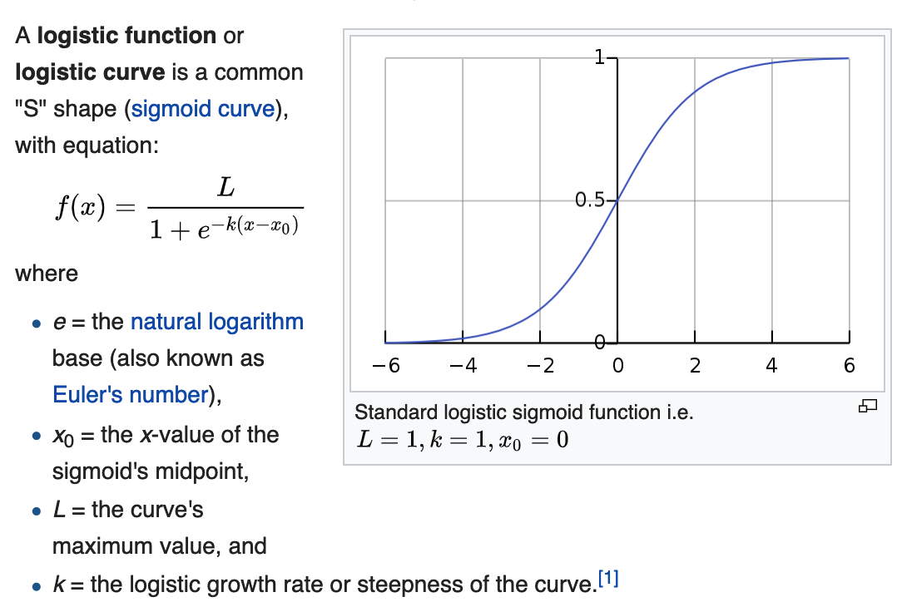
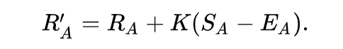

# Measure performance with ELO & Brier Scores

The motivation behind this post is to discuss the concepts of ELO, apply that in an NBA simulation, and then measure it with Brier Scores, in a end-to-end work flow! Thank you to my teacher @MaxHumber, for inspiring this post.

Resources: 
* https://en.wikipedia.org/wiki/Elo_rating_system
* https://projects.fivethirtyeight.com/complete-history-of-the-nba/#raptors
* https://fivethirtyeight.com/features/how-we-calculate-nba-elo-ratings/
* https://en.wikipedia.org/wiki/Brier_score

## Import Libraries


```python
# data wrangling
import pandas as pd
import numpy as np

# plotting
import seaborn as sns
import matplotlib.pyplot as plt
%matplotlib inline
plt.style.use('fivethirtyeight')

# preprocessing & feature engineering
from sklearn.preprocessing import StandardScaler, LabelBinarizer, PolynomialFeatures
from sklearn_pandas import DataFrameMapper, CategoricalImputer, FunctionTransformer
from sklearn.impute import SimpleImputer
from sklearn.pipeline import make_pipeline
from imblearn.over_sampling import SMOTE

# modelling & evaluation
from sklearn.model_selection import train_test_split
from sklearn.linear_model import LogisticRegression
from sklearn.neighbors import KNeighborsClassifier
from sklearn.model_selection import GridSearchCV, cross_val_score
from sklearn.metrics import roc_auc_score, confusion_matrix
# scientific notation off
np.set_printoptions(suppress=True)
# pd.options.display.float_format = '{:.2f}'.format

# suppress warnings
from sklearn.exceptions import DataConversionWarning
import warnings
warnings.filterwarnings(action='ignore', category=DataConversionWarning)
warnings.filterwarnings(action='ignore', category=FutureWarning)
```

# Elo

## Introduction

While I was familiar with the concept of elo given its usage from FiveThirtyEight to measure a basketball team's strength, relative to its peers, I was surprised to find out it was actually derived from chess!

> The Elo rating system, is a method for calculating the relative skill levels of players in zero-sum games such as chess. It is named after its creator Arpad Elo, a Hungarian-American physics professor (Source: Wikipedia).

Over the years, you can see it's extension and adoption to a wide range of use cases, including:
* Video games (CounterStrike, League of Legends)
* Sports (NBA, football, baseball)

Needless to say, it's a very popular framework! Essentially, the idea is that if you a play stronger opponent and win, you should be rewarded more, than if you play lesser opponents and win, and vice versa, in a zero-sum-game paradigm. This argument intuitively makes sense.

## Model

(1) The expected probability of winning of team A follows the logistic curve.



* Note the curve's maximum value is 1
* This is a common sigmoid curve (prob winning approaches 1 and 0, asymptotically)

(2) The parameters in this model:
* Ra - rating of team A
* rb - rating of team B
* g, the logistic growth rate / steepness of curve

Interpretation of g: Given g = 400. For each 400 rating points of advantage over the opponent, the expected score is 10x in comparison to opponent's expected score (assuming log 10 base) Said another way, the higher g, the larger the difference required between winner and loser elo to impact the probability. For the NBA, we will leave this at 400, the same as Chess.

* k-factor - the adjustment per game based on win or loss, to reward under performance and reward over performance. There needs to be a level of stickiness, as you shouldn't lose all of your elo points with one game, and the score retains some memory. 

    * According to FiveThirtyEight, and empirical evidence, the optimal K for the NBA to be 20. it’s in the same range as the K used for NFL and international soccer elo ratings even though the NBA plays far more games than those sports. It’s much higher than the optimal K for baseball. It suggests that you should to give relatively high weight to an NBA team’s recent performance. For reference, it's typically 16 for master chess players.

* Baseline elo score - we will use 1500 for the NBA. This is the long term average elo score.

* Formula to upload team's elo score after each game: 

    * 
    * Previous score + k-factor * (Sa - Ea) 

* Create a table to summarize our parameters


```python
class EloTracker:
    # start baseline elo at 1500
    # EloTracker takes data in the form of a dictionary or a list and shapes it into a dictionary 
    # This is how we're tracking our elo scores
    def __init__(self, data, start=1500):
        if isinstance(data, dict):
            self.data = data
        if isinstance(data, list):
            self.data = {i: start for i in data}
    
    # Expected probability of winning
    # Pr(A) = 1 / (10^(-ELODIFF/400) + 1)
    def prob(self, winner, loser):
        winner_elo, loser_elo = self.data[winner], self.data[loser]
        # add home court advantage
        
# interpretation
# 100 elo ~ 3.5 nba points
# therefore, 100/3.5 is 28x
# ((away_elo - home_elo)+100)/28 ~ 7 point favourite at home
# equivalent to saying home only has 3.5 pt favored if teams
# were evenly matched
        
        expected_winner = 1 / ( 1 + 10**((loser_elo - winner_elo)/400) )
        expected_loser = 1 - expected_winner
        return expected_winner, expected_loser

    def update(self, winner, loser, k=32):
        expected_winner, expected_loser = self.prob(winner, loser)
        self.data[winner] = round(self.data[winner] + k*(1 - expected_winner))
        self.data[loser] = round(self.data[loser] + k*(0 - expected_loser))
        return self.data

    def __repr__(self):
        return f'EloTracker({self.data})'
```


```python
# instantiate all teams at 1500 elo
teams = ['Toronto', 'Boston', 'Cleveland']
elo = EloTracker(teams)
elo.data
```


    {'Toronto': 1500, 'Boston': 1500, 'Cleveland': 1500}


```python
# By definition, teams with the same elo are equally likely to win
elo.prob('Toronto', 'Boston')
```


    (0.5, 0.5)


```python
# Toronto beats Boston
# Update elo; Toronto gained 16 elo and Boston lost 16
elo.update('Toronto', 'Boston')
```


    {'Toronto': 1516, 'Boston': 1484, 'Cleveland': 1500}


```python
# end of season, let's assume these elo scores
teams = {'Toronto': 1750, 'Boston': 1500, 'Cleveland': 1250}
elo = EloTracker(teams)
elo.data
toronto_elo_before = elo.data["Toronto"]
elo.update("Toronto", "Cleveland")
toronto_elo_after = elo.data["Toronto"]

print(f' Toronto gained {toronto_elo_after - toronto_elo_before} elo points')
# Because Toronto won against a worst team, they only gained 2 elo points.
```

     Toronto gained 2 elo points


```python
# end of season, let's assume these elo scores
teams = {'Toronto': 1750, 'Boston': 1500, 'Cleveland': 1250}
elo = EloTracker(teams)
elo.data
toronto_elo_before = elo.data["Toronto"]
elo.update("Cleveland","Toronto")
toronto_elo_after = elo.data["Toronto"]

print(f' Toronto gained {toronto_elo_after - toronto_elo_before} elo points')
# Because Toronto lost to a worse team, they lost 30 elo points! They were expected to win!
```

     Toronto gained -30 elo points


```python
# Let's add home court advantage

# I'm saying that Toronto is win by 78%, if they're at home its even higher
prob('Toronto', 'Boston')
# 78->86
```


    (0.8618278475799177, 0.1381721524200823)


```python
data["Toronto"][1]-data["Boston"][1]
```


```python
loser = 'Boston'
winner = 'Toronto'

k=20
expected_winner, expected_loser = prob(winner, loser)
# score updated from 1218 -> 1222 # increase of 4 pts..
print(data[winner][0] + k*(1 - expected_winner) )

data[winner][0] + k*(1 - expected_winner)* mult("Toronto","Boston")
# they should only win by 1 instead with the multipler

# instead what of Boston won? They'd get a larger multipler.
# It accounts for the fact that favors tend to win by larger margins
# than they lose them. This helps keep ratings stable around 1500, and 
# prevent autocorrelation into the system (source)
```


```python
# Year to Year carry over
# Some ELO graphs
# How to add data science? Talk about brier
* https://en.wikipedia.org/wiki/Brier_score
    
* similar final four with elo
* Calculate the brier score 
```


```python
data = {
    'Toronto': 1090,
    'Boston': 600,
}


k=20
expected_winner, expected_loser = prob("Toronto", "Boston")

data[winner] + k*(1 - expected_winner)
# score updated from 1090 -> 1091, notice how less points were awarded to New York! since they are a worse team
```


```python
# winner has probability of 1, loser has probability o 0
def update(winner, loser, k=20):
    expected_winner, expected_loser = prob(winner, loser)
    data[winner] = round(data[winner] + k*(1 - expected_winner))
    data[loser] = round(data[loser] + k*(0 - expected_loser))
    return data

data
```


```python
# data["Toronto"][0]+20*(1-prob("Toronto","Boston")[0])
```


```python
# let's get the code working first and then we'll add this...

# margin of victory multipler
def mult(winner,loser):
    winner_elo,loser_elo = data[winner][0] , data[loser][0]
    mov = #winning score - #loser score
    mult = (mov + 3)**0.8/(7.5+0.006*(winner_elo-(loser_elo+100)))
    return mult


# add 100 to home elo when calculating prob, and margin of victory
```