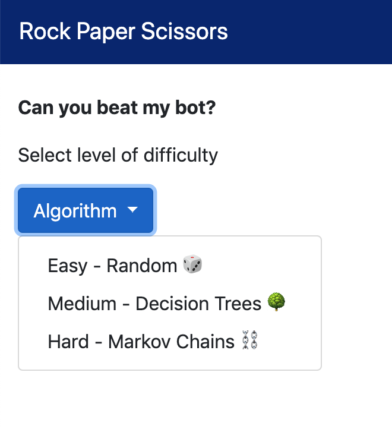
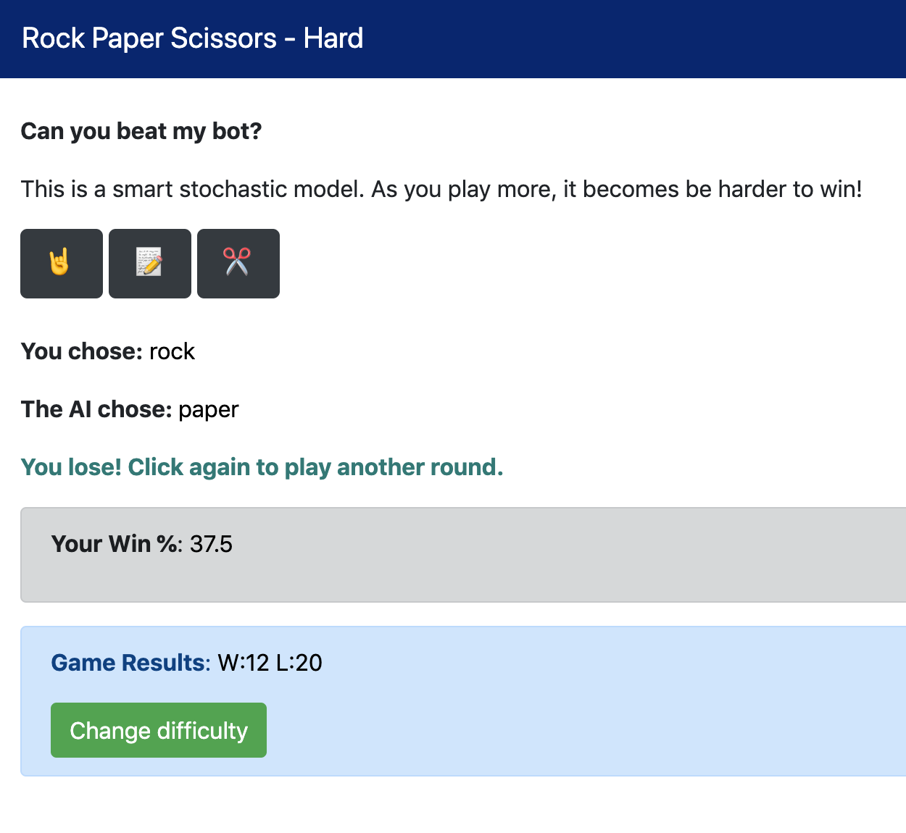

Title: My first hackathon
Date: 2019-05-3 12:00
Topic: Hackathon
Slug: rps

Recently, I participated in my first ever hackathon at [Bitmaker General Assembly](https://bitmaker.co/courses/data-science)! To say it was an eye opening experience would be an understatement. I applied what I've learned so far, by combining concepts from data science and software development. Additionally, it was an exercise to work in pairs, tackle unstructured problems, and think outside the box.

---
### The challenge

Within a day, the challenge was to create a 'smart' rock, paper and scissors bot that can beat a human over 50 games. This would test my data wrangling, predictive modeling, statistics and web development skills.

**My bot must:**
<ul>
  <li>Be built on top of a machine learning algorithm</li>
  <li>Be able to prove that it's not "peeking" at user input (target leakage)</li>
  <li>Have a flask front-end that can accept user input </li>
  <li>Keep track of wins and losses </li>
</ul>

**Stretch goals:**
<ul>
  <li>An ability to switch between different "engines" (naive, random, hard-coded, algorithmic)</li>
  <li>An ability for your bot to learn from my specific play-style and update turn-over-turn</li>
  <li>Flask that's prettier than just a couple of white input boxes </li>
  <li>Your bot to a hosted website on the internet, somehow, somewhere  </li>
</ul>

---
### Creating my first web app

At this point, I had minimal exposure to web development and databases, so I made the most of my current toolkit. By the end of the hackathon, my teammate and I were nearly there in creating a fully functional app. Over the past week, with the help of my instructor, I refactored and completed my first app. What a feeling! 

Tech stack: My web application is written in Python, built on Flask, and hosted on Heroku.

There are 3 difficulties/models for you to play with.
<table class="table table-striped table-responsive table-bordered">
<thead>
  
</thead>
<tbody>
<tr>
<td><b>1. Easy - Naive random model</b></td>
<td> The bot throws rock, paper, scissors with 1/3 probability each. You are expected to win about 50% of the time.</td>
</tr>
    
<tr>
<td><b>2. Medium - Deterministic (random forest) model</b></td>
<td> The bot is trained on 450K+ previously played games. You are expected win less than 50% of the time.
</td>
</tr>

<tr>
<td><b>3. Hard - Stochastic (markov chain) model</b></td>
<td> As you play more, the bot learns your specific playing style and it becomes be harder to win!
</td>
</tr>
    
</tbody>
</table>

Without further ado, here it is (hosted on Heroku, another milestone!).
**[https://rps-bot-garry.herokuapp.com/](https://rps-bot-garry.herokuapp.com/)**

Take a break and see if you can beat my bot 😉




---
### Retrospective

As in any hackathon, there were highs and lows. As a good software development practice, here's my retrospective on my experience.

---
#### 🙂 What went well?
* **Enjoying software development** - Typically, my data science work is in individual scripts on Jupyter Notebook or Atom, a text editor. By using [Flask](http://flask.pocoo.org/), a Python micro web framework, I was able to spin up a lightweight website. It was a boost of confidence to successfully write simple APIs.


* **Creating a click-able prototype** - Learning how to create a click-able prototype is rewarding, as it prepares me for future larger projects. This app has a UI component, and provides better interactivity than a static notebook. 


* **Learning front end basics in HTML and CSS** - As Data Scientists, we should learn just enough HTML and CSS to be capable of building simple apps that showcase our models. It's important to be able to speak a common language with Product Designers and Software Developers, as they are able to take our prototype and improve the overall app. This hackathon pushed me to read and write more HTML and CSS, and I'm glad I discovered OSS libraries such as [Bootstrap](https://getbootstrap.com/).


* **Collaborating in teams** - This was my first time developing with a teammate, and we used GitHub for version control. Fortunately, there was a rough division of labour as I focused on the front end, and Flask component and she focused on the modeling. A good skill to have is to be able to perform code reviews and also merge conflicts. 


* **Creating my first functional app and deploying it on Heroku** 🙌🏼 <br>

---
#### 😐 What was confusing?
* **Preparing the data into form ready for machine learning algorithms** - This data was not ready in its raw form, and observations had to be grouped into what was thrown in a game, and the player's following throw. Using dictionaries and Pandas DataFrames helped tackle this problem. For example, if I created a feature that required the player's previous n throws, then I would need n user throws before I would be able to make one new prediction!
    
    
* **Crystalizing my understanding of Markov Chains** Markov chains are used in Bayesian statistics and implementing PyMC3. In the case of rock paper scissors, this was another opportunity to leverage Markov Chain's stochastic process.

> The Markov property refers to the memoryless property of a stochastic process. By definition, if the conditional probability distribution of future states of the process  depends only upon the _present state_, not on the sequence of events that preceded it.


Said another way, by using Markov Chain, a smart bot should be able to pick up if a player is only playing rock after a particular scenario, and subsequently throw paper. The bot is predicting that player transitions from one state to another state with a probabilistic process.

* **Wrestling with localhost, prototyping in Atom and Terminal** - Practice, practice, practice. While this is new to me, I'm appreciate prototyping in Atom and Terminal more and more than in Jupyter notebooks. By using [Hydrogen](https://atom.io/packages/hydrogen), a package on Atom, I'm able to run code interactively and 'peak' into objects in-line in real time. 

* **Becoming more comfortable with object oriented programming** - By continuing to better understand Classes, I'm learning how to better bundle functions together efficiently, and use methods for modifying state. <br>

---
#### 🙁 What was challenging?
* **Time constraints** - During a hackathon, there's a expectation to ship code quickly, and there can be feelings of self-doubt and anxiety. From this experience, I'll be better prepared to manage my time more efficiently, and also know when to take a breather to bounce ideas off teammates and ask for help when needed.


* **Capturing a new user-generated data point, and saving it to an object to re-train the model** - While I will be learning databases very soon, state wasn't a problem I had to explicitly deal with yet, but is very present in real world applications. I have to be aware of all the transformations required to feed a new data point into my model. This can be difficult even with pipelines.


* **When your problem is a random process** - Many machine learning models which are trained on a large data set are deterministic, and may not be the right model to reach for. Instead, reach for the algorithm that is better suited for random processes, like Markov Chains.


* **Lots of trial and error and Stack Overflow** - Compiling errors are not fun. <br>

---
### Quick start with Heroku

Heroku is a third-party cloud hosting provider that runs your application. 

This was a stretch goal, but I really wanted to host my app, so I could share it! I chose Heroku because it has a free level service, is user friendly for Python apps, and comes with many tutorials. 

This is a quick start guide only, please see the resources below for more documentation. <br>

--- 
#### Prerequisites
- Your app is in a Git repository, such as GitHub. 
- Create a free account on [Heroku](https://www.heroku.com/) 
- Install the Heroku CLI for interacting with the service
- In your app directory, create a ```runtime.txt``` and inside the file, specify your version of Python (e.g. python-3.6.8) 
```$ python -V``` if you don't know
- Create a ```requirements.txt```, and inside the file specify your app's dependencies
```$ pip freeze > requirements.txt ``` Note, this lists all your dependencies, so you should scrub it for only the modules your app needs.
- Add ```gunicorn```, the web server recommended by Heroku for Python apps to the requirements.txt
- Create a text file named ```Procfile```, and inside the file declare the command to execute and start your web app. 
```web: gunicorn app:app``` where the first app refers to the module, and the second app refers to the app function name.
<br>

---
#### Commands
1. From the terminal, login to the Heroku CLI. Enter your credentials.
```$ heroku login```

2. Ensure your app is in a ```git``` repository.

3. Create an app on Heroku to receive your source code. Pass a unique application name as the argument
```$ heroku apps:create rps-bot-garry```  
Your URL is now live at ```https://rps-bot-garry.herokuapp.com/```

4. Final step is to deploy. This is akin to pushing from local Git repo to GitHub. Push code from local repo to Heroku repo.
- ```$ git add .```
- ```$ git commit -m "deploy app"```
- ```$ git push heroku master```

And that's a wrap, you've deployed your first app onto Heroku's servers! Now visit your app. My app is hosted at ```https://rps-bot-garry.herokuapp.com/```

---
### Lessons learned

1. Start small. Make a quick and dirty solution that works first.
2. Think about new data. How will you transform a new piece of data, transform it and re-train your model?
3. Conceptualize how to surface your model.

As Data Scientists, it's important to bridge the gap to software development in order to create functional apps, in an end-to-end workflow, because an app is often more compelling to your audience. It's can be very effective medium to communicate ideas. 

During Hackathons, in addition to my Data Science role, I'll very likely have to think like a Designer, and Web Developer!

---
### Resources
* [A great primer by a Data Scientist at Twitter for building a web application](https://medium.com/@rchang/learning-how-to-build-a-web-application-c5499bd15c8f)
* [Flask tutorial - I referenced Miguel's chapters 18 and 2 for Heroku and Templates](https://blog.miguelgrinberg.com/post/the-flask-mega-tutorial-part-xviii-deployment-on-heroku)
* [Heroku documentation](https://devcenter.heroku.com/articles/getting-started-with-python)
* All code for my bot is available on [GitHub](https://github.com/garrrychan/hackathon_rps).